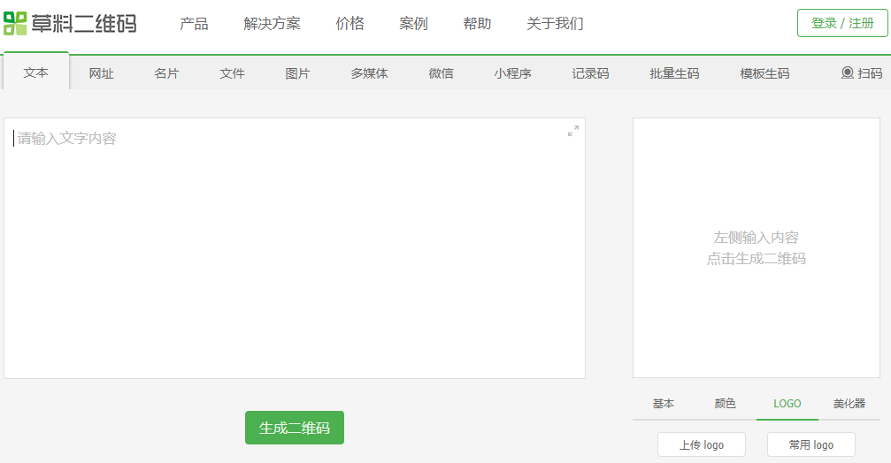

# Webpack配置
从package.json开始，当输入`npm run dev`时执行`node build/dev-server.js`，

# 制作图标字体 -- https://icomoon.io


# linkActiveClass 
* 默认值是 `v-link-active`  
配置当 v-link 元素匹配的路径时需要添加到元素上的class。只要当前路径以 v-link 的URL开头，这个class就会被添加到这个元素上。活跃匹配的规则和添加的class也可以通过 v-link 的内联选项单独指定。

# 移动端1px边框问题  
在web端1px就是1px，但是在移动端有可能会很粗。  
```stylus
// minxin.stylus
border-1px($color)
  position: relative
  &:after
    display: block
    position: absolute
    left: 0
    bottom: 0
    width: 100%
    border-top: 1px solid $color
    content: ' '


@media (-webkit-min-device-pixel-ratio: 1.5),(min-device-pixel-ratio: 1.5)
  .border-1px
    &::after
      -webkit-transform: scaleY(0.7)
      transform: scaleY(0.7)

@media (-webkit-min-device-pixel-ratio: 2),(min-device-pixel-ratio: 2)
  .border-1px
    &::after
      -webkit-transform: scaleY(0.5)
      transform: scaleY(0.5)
```
* 设备像素比devicePixelRatio介绍：  
定义：window.devicePixelRatio是设备上的物理像素和设备独立像素（device-independent pixels（dips））的比例。

* 在不同设备插入图片可使用公共样式  
```stylus
bg-image($url)
  background-image: url($url + "@2x.png")
  @media (-webkit-min-device-pixel-ratio: 3),(min-device-pixel-ratio: 3)
    background-image: url($url + "@3x.png")
```

* Css Sticky footers布局  
在网页设计中，Sticky footers设计是最古老和最常见的效果之一，大多数人都曾经经历过，它可概括如下：如果页面内容不够长的时候，页脚块粘贴在视窗底部，如果内容足够长时，页脚块会被内容向下推送。

* 把一个网站地址生成二维码  
草料二维码生成器：https://cli.im/ 
