# 1. Vue学习内容  

## 1.1 环境搭建
兼容性：Vue.js不支持IE8及以下版本，因为Vue.js使用了IE8不能模拟的ECMAScript5特性，它支持所有兼容ECMAScript5的浏览器；  
引入方式：  
1. 直接用`<script>`引入：直接下载并使用`<script>`标签引入，Vue会被注册为一个全局变量（在开发时请使用开发版本，遇到常见错误它会给出友好的警告）；  

2. CDN：推荐：https://cdn.jsdelivr.net/npm/vue， 会保持和 npm 发布的最新的版本一致。可以在 https://cdn.jsdelivr.net/npm/vue/ 浏览 npm 包资源。也可以从 unpkg 和 cdnjs 获取 (cdnjs 的版本更新可能略滞后)；

3. NPM：在使用Vue.js构建大型应用时推荐使用NPM安装，命令为：npm install vue； 

4. 命令行工具（CLI）：Vue.js提供一个官方命令行工具，可用于快速搭建大型单页应用：  
全局安装 vue-cli------npm install --global vue-cli  
创建一个基于 webpack 模板的新项目--------vue init webpack my-project  
安装依赖--------cd my-project----------npm install  
运行项目-------npm run dev  


## 1.2 框架学习  

### 1.2.1 Vue实例
每一个Vue应用都是通过Vue函数创建一个新的Vue实例开始的： 
```javascript
var vm = new new({
  //选项
})
```
虽然没有完全遵循MVVM模型，Vue的设计也受到了它的启发，在文档中会使用vm（ViewModel的简称）这个变量名表示Vue实例；  
当创建一个Vue实例时，可传入一个选项对象，要通过这些选项来创建想要的行为。  
当一个Vue实例被创建时，它向Vue的响应式系统中加入了其data对象中能找到的所有属性，当这些属性发生改变时，视图将会产生“响应”，匹配更新为新的值。
```javascript
//数据对象
var data = {a: 1}

//该对象被加入到一个Vue实例中
var vm = new Vue({
  data: data
})

//他们引用相同的对象
vm.a === data.a           // => true

//设置属性也会影响到原始数据
vm.a =2;
data.a        // => 2

// ...反之亦然
data.a =3;
vm.a         // => 3
```

值得注意的是只有当实例被创建时data中存在的属性是响应式的，如果添加一个新的属性，像 vm.b=’hi’，那么对b的改动不会触发任何视图的更新。  
每一个Vue实例在被创建之前都要经过一系列的初始化过程，在这个过程中会运行一些生命周期钩子函数，让用户在一些特定的场景下添加他们自己的代码，比如created钩子可以用来在一个实例被创建之后执行的代码：
```javascript
new Vue({
  data: {
    a: 1
  },
  created: function () {
    // `this`指向vm实例
    console.log(`a is: ` + this.a);
  }
})
// => 'a is: 1'
```
还有一些其他的生命周期函数，在实例生命周期的不同场景下调用，如mounted、updated、destroyed等等。注意不要在属性或回调上使用箭头函数，因为箭头函数是和父级上下文绑定在一起的，this不会是所预期的Vue实例。下面是生命周期图示：  
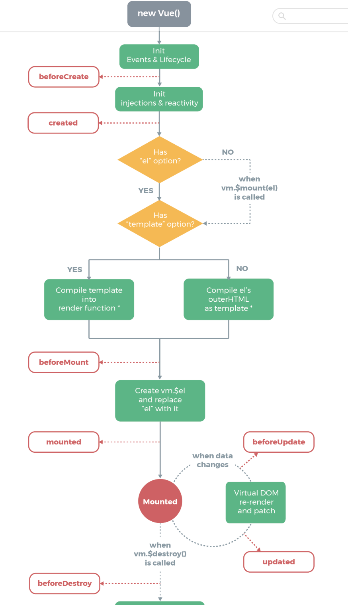
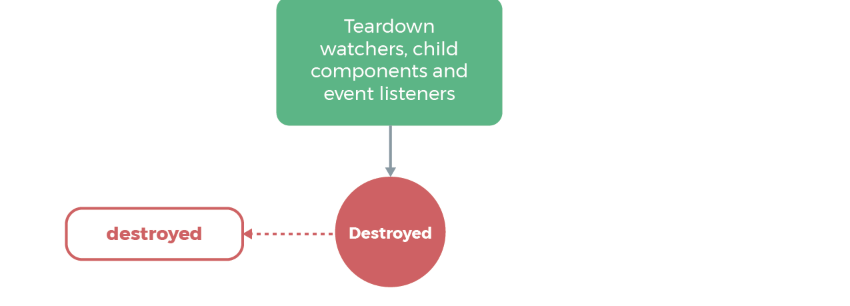  

### 1.2.2 模板语法
Vue.js 使用了基于 HTML 的模板语法，允许开发者声明式地将 DOM 绑定至底层 Vue 实例的数据。所有 Vue.js 的模板都是合法的 HTML ，所以能被遵循规范的浏览器和 HTML 解析器解析。  
在底层的实现上，Vue 将模板编译成虚拟 DOM 渲染函数。结合响应系统，在应用状态改变时，Vue 能够智能地计算出重新渲染组件的最小代价并应用到 DOM 操作上。  
1. 差值  
数据绑定最常用的就是使用“Mustache”（双大括号）的文本插值：
```javascript
<span>Message: {{ msg }}</span>
```
Mustache标签将会被替代为对应数据对象上的msg属性的值，无论何时，绑定的数据对象上msg属性发生了改变，插值处的内容都会更新，当使用v-once指令时，可执行一次性插值，当数据改变时，插值处的内容不会更新：
```HTML
<span v-once>这个不会改变：{{msg}}</span>
```
2. 原始HTML
双大括号会将数据解释为普通文本，而非HTML，为了输出真正的HTML，需要使用v-html指令：
```html
  <p>Using mustaches: {{rawHtml}}</p>
  <p>Using v-html directive: <span v-html="rawHtml"></span></p>
```
3. 特性
Mustache语法不能作用在HTML特性上，下面这种情况应该使用v-bind指令：
```html  
<div v-bind: id = "dynamicId"></div>
<button v-bind: disabled="isButtonDisabled">Button</button>
```
4. 使用JavaScript表达式
对于所有的数据绑定，vue.js提供完全的JavaScript表达式支持：  
```javascript
{{number + 1}}
{{ok? 'yes' : 'no'}}
{{message.split('').reverse().join('')}}
<div v-bhind: id = "'list-'+id"></div>
```
有一个限制就是，每一个绑定只能包含单个表达式，像下面的例子都不会生效：
```javascript
//这是语句，不是表达式
{{ var a = 1 }}
//控制流也不会生效，可使用三元表达式
{{ if(ok){ return message } }}
```

### 1.2.3 指令
指令（Directives）是带有v-前缀的特殊属性，指令的职责是，当表达式的值改变时将其连带的影响，响应式地作用于DOM：
```html
<p v-if='seen'>现在你看到我了</p>
```
一些指令能够接受一个“参数”，在指令名称以后以冒号表示，例如：
```html
<a v-bind:href='url'></a>
```
此处的href是参数，告知v-bind指令将该元素的href属性与表达式的URL的值绑定，另外一个是v-on指令，用于监听DOM事件：
```html
<a v-on:click="doSomething">...</a>
```
使用修饰符用于指出一个指令应该以特殊方式绑定，例如，.prevent修饰符告诉v-on指令对于触发的事件调用event.preventDefault()；
```html
<form v-on: submit.prevent="onSubmit">...</form>
```
缩写方法：
```html
<!-- 完整语法 -->
<a v-bind: href = "url">...</a>
<!-- 缩写 -->
<a :href = "url">...</a>

<!-- 完整语法 -->
<a v-on: click = “doSomething”>...</a>
<!-- 缩写 -->
<a @click = "doSomething">...</a>
```

### 1.2.4 计算属性
模板内的表达式非常便利，但是设计它们的初衷是用于简单运算的，在模板中放入太多的逻辑会让模板过重难以维护，如：
```html
<div id="examle">
{{message.split('').reverse().join('')}}
</div>
```
对于复杂的逻辑，应该使用计算属性，例如：
```html
<div id="examle">
  <p>Origianl message: "{{message}}"</p>
  <p>Computed reversed message: "{{reverseMessage}}"</p>
</div>
```
```javascript
var vm = new Vue({
  el: "#examle",
  data: {
    message: 'Hello',
  },
  Computed: {
    //计算属性的getter
    reversedMessage: function () {
      //`this`指向vm实例
      return this.message.split('').reverse().join('')
    }
  }
})
```
同样，可以通过在表达式中调用方法来达到同样的效果：
```html
<p>Reversed message: "{{ reversedMessage() }}"</p>
```
```javascript
//在组件中
methods: {
  reversedMessage: function () {
    return this.message.split('').reverse().join('');
  }
}
```
以上两种方式的结果是完全相同的，不同的是，计算属性是基于它们的依赖进行缓存的，计算属性只有在它的相关依赖发生改变时才会重新求值，这个就意味着只要message还没有发生改变，多次访问reverseMessage计算属性就会立即返回之前的计算结果，而不必再次执行函数。 

### 1.2.5 Class与Style绑定
操作元素的class列表和内联样式是数据绑定的一个常见需求，可以用v-bind处理。在将v-bind用作class和style时，Vue.js做了专门的增强，表达式结果的类型除了字符串之外，还可以是对象或数组。
1. 对象语法
可传给v-bind:class一个对象，以动态地切换class：
```html
<div class="static" v-bind:class="{active: isActive, 'text-dange': hasError}"></div>
```
上面的语法表示active和‘text-danger’这两个class的存在与否取决于数据属性isActive和hasError的truthiness，此外，v-bind:class指令也可以与普通的class属性共存，如果data如下：
```javascript
data: {
  isActive: true,
  hasError: false,
}
```
渲染结果为：
```html
<div class="static active"></div>
```
绑定的数据对象不必内联定义在模板里：
```html
<div v-bind: class="classObj"></div>
```
```javascript
data: {
  classObj: {
    active: true,
    'text-danger': false
  }
}
```
这个渲染结果和上面的一样。
2. 数组语法
可以把一个数组传给v-bind:class，以应用一个class列表：
```html
<div v-bind:class="[activeClass, errorClass]"></div>
```
```javascript
data: {
  activeClass: 'active',
  errorClass: 'text-danger'
}
```
如果想根据条件切换列表中的class，可以使用三元表达式：
```html
<div v-bind:class="[isActive ? activeClass:'', errorClass]"></div>
```
在数组语法中以可以使用对象语法：
```html
<div v-bind:class="[{active: isActive}， errorClass]"></div>
```
3. 用在组件上 
当在一个自定义组件上使用class属性时吗，这些类将被添加到该组件的根元素上，这个元素上已经存在的类不会被覆盖。例如，声明了这个组件：
```javascript
Vue.component('my-component', {
  template: '<p class="foo bar">Hi</p>'
})
```
使用时又添加了一些class：
```html
<my-component class="baz boo"></my-component>
```
最终渲染为：
```html
<p class="foo bar baz boo"></p>
```
4. 绑定内联样式
```html
<div v-bind: style="styleObj"></div>
```
```javascript
data: {
  styleObj: {
    color: 'red',
    fontSize: '13px'
  }
}
```

### 1.2.6 条件渲染
在vue中，使用v-if指令实现一个块的显示与隐藏：
```html
<h1 v-if="ok">Yes</h1>
```
也可以用v-else添加一个“else”块：
```javascript
<h1 v-if="ok">yes</h1>
<h1 v-if="ok">no</h1>
```
如果想切换多个元素，可以把`<template>`元素当做一个不可见的包裹元素，并在上面使用v-if，最终的渲染结果将不包含`<template>`元素：
```html
<template v-if='ok'>
  <h1>Title</h1>
  <p>Paragraph 1</p>
  <p>Paragraph 2</p>
</template>
```
v-else-if，充当v-if的“else-if”块，可连续使用：
```html
<div v-if="type===A">A</div>
<div v-else-if==="B">B</div>
<div v-else-if==="C">C</div>
<div v-else>No A/B/C</div>
```
v-if与v-show比较：v-if是真正的条件渲染，它会确保在切换过程中条件块内的事件 监听和子组件适当地被销毁和重建，v-if是惰性的，如果在初始渲染时条件为假，则上面也不做；而v-show不管初始条件是什么，元素总是会被渲染，并且只是简单地基于CSS进行切换。  
一般来说，v-if有更高的切换开销，v-show有更高的初始值渲染开销，因此，如果需要非常频繁地切换，则使用v-show较好，如果在运行时条件很少改变，则使用v-if较好。

### 1.2.7 列表渲染
Vue用v-for指令根据一组数组的选项列表进行渲染，v-for指令需要使用 item in items形式的特殊语法，items是源数据数组并且item是数组元素迭代的别名。
```html
<ul id="example-1">
  <li v-for="itme in items">{{item.message}}</li>
</ul>
```
```javascript
var example1 = new Vue({
  el: '#example-1',
  data: {
    items: [
      { message: "Foo" },
      { message: "Bar" }
    ]
  }
})
```
遍历对象时：
```html
<div v-for="(value, key, index) in object">
  {{index}}. {{key}} : {{value}}
</div>
```

### 1.2.8 时间处理
可以用v-on指令监听DOM事件，并在触发时运行一些JavaScript代码，例如：
```html
<div id="examle2">
<!-- 'greet' 是在下面定义的方法名 -->
<button v-on: click="greet">Greet</button>
</div>
```
```javascript
var examle2 = new Vue({
  el: "#examle2",
  data: {
    name: 'Vue.js'
  },
  methods: {
    greet: function (event) {
      //`this`在方法里指向当前Vue实例
      alert('Hello' + this.name + '!');

      //`event`是原生DOM事件
      if(event){
        alert(event.target.tagName);
      }
    }
  }
})
```
在事件处理程序中调用event.preventDefault()或event.stopPropagation()是非常常见的需求，Vue.js为v-on提供了事件修饰符，例如：.stop、.prevent、.capture、.self、.once等等，还有一些按键修饰符：.enter、.tab、.delete、.esc、.space、.up、.down、.left、.right；用法
```html
<!-- 只有在‘keyCode’是 13 时调用`vm.submit（）` -->
<input v-on: keyup.13="submit">
<input v-on: keyup.enter="submit">

<!-- 缩写语法 -->
<input @keyup.enter="submit">
```

### 1.2.9 表单输入绑定
可通过v-model指令在表单控件元素上创建双向数据绑定，它会根据控件类型自动选取正确的方法来更新元素。例如：
```html
<input v-modal="message" placeholder="edit me">
<p>Message is: {{message}}</p>
```

### 1.2.10 组件
1. 注册组件
要祖册一个全局组件，可以使用Vue.component(tagName, options),例如：
```javascript
Vue.component('my-component', {
  // 选项
})
```
组件在注册之后，便可以作为自定义元素`<my-component></my-component>`在一个实例的模板中使用，确保在初始化根实例之前注册组件：
```html
<div id="exmaple">
  <my-component></my-component>
</div>
```
```javascript
//注册
Vue.component('my-component', {
  template: '<div>A custom componnet</div>'
})
//创建根实例
new Vue({
  el: '#example'
})
```
局部注册时，可通过某个Vue实例/组件的实例选项components注册仅在其作用域中可用的组件：
```javascript
var child = {
  template: '<div>A custom component</div>'
}
new Vue({
  //...
  components: {
    //<my-componnet>将只在父组件模板中可用
    'my-component': Child,
  }
})
```

2. DOM模板解析注意事项  
当使用DOM作为模板时，会受到HTML本身的一些限制，像`<ul>`、`<ol>`、`<table>`、`<select>`这样的元素里允许包含的元素有限制，而像`<option>`这样的元素只能出现在某些特定元素的内部。例如：
```html
<table>
  <my-row>...</my-row>
</table>
```
此时自定义组件<my-row>会被当做无效的内容，导致错误的渲染结果，此时应使用特殊的is特性：
```html
<table>
  <tr is="my-row"></tr>
</table>
```

3. data必须是函数
	构造Vue实例时传入的各种选项大多数都可以在组件里使用，只有一个例外：data必须是函数。

4. 使用prop传递数据
组件实例的作用域是孤立的，父组件的数据需要通过prop才能下发动子组件中，子组件要显式地用props选项声明它预期的数据：
```javascript
Vue.component('child', {
  //声明props
  props: ['message'],
  //就像data一样，prop也可以在模板中使用
  //同样也可以在vm实例中通过this.message来使用
  template: '<span>{{message}}</span>'
})
```
然后向它传入一个普通字符串：
```html
<child message="hello!"></child>
```

5. 字面量语法和动态语法
初学者长犯的一个错误是使用字面量语法传递数值：
```html
<!-- 传递了一个字符串 “1” -->
<comp some-prop="1"></comp>
```
因为它是一个字面量prop，它的值是字符串“1”而不是一个数值，如果想传递一个真正的JavaScript数值，则需要使用v-bind，从而让它的值被当作JavaScript表达计算：
```html
<!-- 传递真正的数值 -->
<comp v-bind: some-prop ="1"></comp>
```

6. prop验证
可以为组件的prop指定验证规则，如果传入的数据不符合要求，Vue会发出警告，要指定验证规则，需要用对象的形式来定义prop，而不能用字符串数组：  
```javascript
Vue.component('examle', {
  props:{
    //基础类型检测（`null`指允许任何类型）
    propA: number,
    //可能是多种类型
    propB: [String, Number],
    //必传且是字符串
    propC: {
      type: String,
      required: true,
    },
    //数值且有默认值
    propD: {
      type: Number,
      default: 100,
    },
    //数组/对象的默认值应当由一个工厂函数返回
    propE: {
      type: Object,
      default: function() {
        return { message: 'hello' }
      }
    },
    //自定义验证函数
    propF: {
      validator: function(value) {
        return value > 10;
      }
    }
  }
})
```

7. 使用v-on绑定自定义事件
每个Vue实例都实现了事件接口，即：使用$on(ventName)监听事件，使用$emit(eventName)触发事件。
```html
<div>
  <p>{{total}}</p>
  <button-counter v-on:increment="incrementTotal"></button-counter>
  <button-counter v-on:increment="incrementTotal"></button-counter>
</div>
```
```javascript
Vue.component('button-counter', {
  template: '<button v-on:click="incrementCounter">{{counter}}</button>',
  data: function() {
    return {
      counter: 0
    }
  },
  methods: {
    incrementCounter: function(){
      this.counter += 1;
      this.$emit('increment')
    }
  }
})

new Vue({
  el: '#counter-event-example',
  data: {
    total: 0,
  },
  methods: {
    incrementTotal: function () {
      this.total += 1;
    }
  }
})
```

8. 单个插槽
除非子组件模板包含至少一个`<slot>`插口，否则父组件的内容将会被丢弃。当子组件模板只有一个没有属性的插槽时，父组件传入的整个内容片断将插入到插槽所在的DOM位置，并替换掉插槽标签本身。最初在`<slot>`标签中的任何内容都被视为备用内容，只有在宿主元素为空，且没有要插入的内容时才显示备用内容。例如my-component组件的模板如下：
```html
<div>
  <h2>我是子组件</h2>
  <slot>
    只有在没有要分发的内容时才会显示。
  </slot>
</div>
```
父组件模板如下：
```html
<div>
  <h1>我是父组件</h1>
  <my-component>
    <p>这是初始内容</p>
  </my-component>
</div>
```
则渲染结果为：
```html
<div>
  <h1>我是父组件</h1>
  <div>
    <h2>我是子组件的标题</h2>
    <p>这是初始内容</p>
  </div>
</div>
```

9. 具名插槽
`<slot>`元素可以用一个特殊的特性name来进一步配置如何分发内容，多个插槽可以有不同的名字，具名插槽匹配内容片断中有对应slot特性的元素。仍然可以有一个匿名默认插槽，作为找不到匹配内容片断的备用插槽，如果没有，这些找不到匹配内容的片断将被抛弃。例如，现有一个app-layout组件，它的模板为：
```html
<div class="container">
  <header>
    <slot name="header"></slot>
  </header>
  <main>
    <slot></slot>
  </main>
  <footer>
    <slot name="footer"></slot>
  </footer>
</div>
```
父组件模板：
```html
<app-layout>
  <h1 slot="header">页面标题</h1>

  <p>主要内容的一个段落</p>
  <p>另一个主要段落</p>

  <p slot="footer">这里有一些联系信息</p>
</app-layout>
```
渲染结果为：
```html
<div class="container">
  <header>
    <h1 slot="header">页面标题</>
  </header>
  <mian>
    <p>主要内容的一个段落</p>
    <p>另一个主要段落</p>
  </mian>
  <footer>
    <p slot="footer">这里有一些联系信息</p>
  </footer>
</div>
```


## 1.3 路由
### 1.3.1 安装
直接下载：https://unpkg.com/vue-router/dist/vue-router.js;  
NPM方式： npm install vue-router；如果在一个模块化工程中使用它，必须要通过Vue.use()明确地安装路由功能：
```javascript
import Vue from 'vue';
import VueRouter from 'vue.-router',
```

### 1.3.2 基础使用
用Vue.js+vue-router创建单页应用是比较简单的，我们需要做的是，将组建映射到路由，然后告诉vue-router在哪里渲染它们，下面是一个基本例子：
```html
<div id='app'>
  <h1>Hello App!</h1>
  <p>
    <!-- 使用router-link组件来导航  -->
    <!-- 通过传入 ‘to’ 属性制定链接 -->
    <!-- <router-link> 默认会被渲染成一个 <a> 标签-->
    <router-link to="/foo">Go to Foo</router-link>
    <router-link to="/bar">Go to Bar</router-link>
  </p>

  <!-- 路由出口 -->
  <!-- 路由匹配到的组件将渲染在这里 -->
  <router-view></router-view>
</div>
```
```javascript
//1.定义（路由）组件
//可以从其他文件import进来
const Foo = {template: '<div>foo</div>'}
const Bar = {template: '<div>bar</div>'}
//2.定义路由
//每个路由应该映射一个组件，其中“component”可以是通过Vue.extend()创建的组件构造器，或者，只是一个组件配置对象，
const routes = [
  {path: '/foo', component: Foo},
  {path: '/bar', component: Bar}
];
//3.创建router实例，然后传‘routes’配置
const router = new VueRouter({
  routes
})
//4.创建和挂载根实例
//记得要通过router配置参数注入路由，从而让整个应用都有路由功能
const app = new Vue({
  router
}).$mount('#app')
```

### 1.3.3 动态路由匹配
我们经常需要把某种模式匹配到的所有路由全都映射到同一个组件，例如一个User组件，对所有Id不同的用户都要用这个组件来渲染，这时可以在vue-router的路由路径中使用“动态路径参数”来达到这个效果：
```javascript
const User = {
  template: '<div>User</div>'
}
const router = new VueRouter({
  routes: [
    //动态路径参数，以冒号开头
    {path: '/user/:id', componnet: User}
  ]
})
```
当使用路由参数时，发生跳转时，原来的组件实例会被复用，因为两个路由都渲染同一个组件，比起销毁再创建，复用显得更加高效，但是这就意味着组件的生命周期钩子不会再被调用。复用组件时，要对路由参数的变化做出相应的话，可以用watch（检测变化）$route对象：
```javascript
const User = {
  template: '..........',
  watch: {
    '$route' (to, from ){
      // 对路由变化做出相应........
    }
  }
}
```
也可以使用2.2中引入的beforeRouteUpdate守卫：
```javascript
const User = {
  template: '........',
  beforeRouteUpdate(to, from, next){
    //react to route changes......
    //don't forget to call next()
  }
}
```

### 1.3.4 嵌套路由
在实际应用中，界面通常是由多层嵌套的组件组合而成，URL中各段动态路径也按某种结构对应嵌套的各层组件。借助vue-router，使用嵌套路由配置，即可以很简单地表达这种关系：
```html
<div id="app">
  <router-view></router-view>
</div>
```
```javascript
const User = {
  template: '<div>Ueser {{$route.param.id}}</div>'
}
const router = new VueRouter({
  routes: [
    {path: '/user/:id', component: User}
  ]
})
```
这里的<router-view>是最顶层的出口，渲染最高级路由匹配到的组件，同样地，一个被渲染组件同样可以包含自己的嵌套<router-view>，例如，在User组件的模板添加一个<router-view>:
```javascript
const User = {
  template: `
    <div class="user">
      <h2>User {{$route.params.id}}</h2>
    </div>
  `
}
```
要在嵌套的出口中渲染组件，需要在VueRouter的参数中使用children配置：
```javascript
const router = new VueRouter({
  routes:[
    {
      path: '/user/:id', component: User,
      children: [
        {
          //当/user/:id/profile匹配成功，
          //UserProfile会被渲染在User的<router-view></router-view>中
          path: 'profile',
          component: UserProfile
        },
        {
          //当/user/:id/posts 匹配成功
          //UserPosts 会被渲染在User的<router-view>中
          path: 'posts',
          component: UserPosts
        }
      ]
    }
  ]
})
```

### 1.3.5 编程式导航
除了使用<router-link>创建a标签来定义导航链接，还可以借助router的实例方法，通过router.push(location, onComplete? ,  onAbort)来实现，这个方法回向history栈添加一个新的记录，所以当用点击浏览器的后退按钮时，则回到之前的url。该方法的参数可以是一个字符串路径，或者一个描述地址的对象：
```javascript
//字符串
router.push('home');

//对象
router.push({name: 'user', params: {userId: 123}})

//命名的路由
router.push({name: 'user', params: {userId: 123}})

//带查询参数，变成/register?plan=private
router.push({path: 'register', query: {plan: 'private'}})
```

### 1.3.6 命名路由和试图
通过一个名称来标识一个路由显得更方便一些，特别是在链接一个路由，或者执行一些跳转的时候。在创建Router实例的时候在routes配置中给某个路由设置名称：
```javascript
const router = new VueRouter({
  routes: [
    {
      path: '/user/:userId',
      name: 'user',
      component: User
    }
  ]
})
```
要链接到一个命名路由，可以给rouer-link的to属性传一个对象：
```html
<router-link :to="{name: 'user', params: {userId:123}}">User</router-link>
```
有时候想同时（同级）展示多个视图，而不是嵌套展示，可以在界面中有多个单独命名的视图，而不是只有一个单独的出口，如果router-view没有设置名字，默认为default。
```html
<router-link :to="{name: 'user', params: {userId:123}}">User</router-link>
<router-link :to="{name: 'user', params: {userId:123}}">User</router-link>
<router-link :to="{name: 'user', params: {userId:123}}">User</router-link>
```
一个视图使用一个组件渲染，因此对于同个路由，多个视图就需要多个组件，确保正确使用components配置：
```javascript
const router = new VueRouter({
  routes: [
    {
      path: '/',
      components: {
        default: Foo,
        a: Bar,
        b: Baz
      }
    }
  ]
})
```

### 1.3.7 子组件应用
尽管有prop和事件，但是有时仍然需要在JavaScript中直接访问子组件，为此可以使用ref为子组件制定一个引用ID，例如：
```html
<div id="parent">
  <user-profile ref="profile"></user-profile>
</div>
```
```javascript
var parent = new Vue({el:'#parent'})
//访问子组件实例
var child = parent.$refs.profile;
```
当ref和v-for一起使用时，获取到的引用会是一个数组，包含和循环数据源对应的子组件。注意$refs只在组件渲染完成后才填充，而且它是非响应式的，它仅仅是一个直接操作子组件的应急方案，应避免在模板或计算属性中使用$refs。


# 2. 项目内容

## 2.1 Vue-cli
Vue-cli是Vue的脚手架工具，安装方法，
```cmd
npm install -g vue-cli
```
用法：
```cmd
vue init <template-name> <project-name>
```
例如：
```cmd
vue init  webpack my-project
```

## 2.2 Webpack配置
从package.json开始，当输入`npm run dev`时执行`node build/dev-server.js`；  
路径配置：
```JavaScript
var path = require('path');

function resolve(dir){
  return path.join(_dirname, '...', dir)
}

module.exports = {
  extensions: ['.js','.vue','.json'],
  alias: {
    '@': resolve('src');
    'common': resolve('src/common'),
    'components': resolve('src/components'),
    'api': resolve('src/api'),
    'base': resolve('src/base'),
  }
}
```

## 2.3 制作图标字体 -- https://icomoon.io


## 2.4 linkActiveClass 
* 默认值是 `v-link-active`  
配置当 v-link 元素匹配的路径时需要添加到元素上的class。只要当前路径以 v-link 的URL开头，这个class就会被添加到这个元素上。活跃匹配的规则和添加的class也可以通过 v-link 的内联选项单独指定。

### 移动端1px边框问题  
在web端1px就是1px，但是在移动端有可能会很粗。  
```stylus
// minxin.stylus
border-1px($color)
  position: relative
  &:after
    display: block
    position: absolute
    left: 0
    bottom: 0
    width: 100%
    border-top: 1px solid $color
    content: ' '


@media (-webkit-min-device-pixel-ratio: 1.5),(min-device-pixel-ratio: 1.5)
  .border-1px
    &::after
      -webkit-transform: scaleY(0.7)
      transform: scaleY(0.7)

@media (-webkit-min-device-pixel-ratio: 2),(min-device-pixel-ratio: 2)
  .border-1px
    &::after
      -webkit-transform: scaleY(0.5)
      transform: scaleY(0.5)
```
* 设备像素比devicePixelRatio介绍：  
定义：window.devicePixelRatio是设备上的物理像素和设备独立像素（device-independent pixels（dips））的比例。

* 在不同设备插入图片可使用公共样式  
```stylus
bg-image($url)
  background-image: url($url + "@2x.png")
  @media (-webkit-min-device-pixel-ratio: 3),(min-device-pixel-ratio: 3)
    background-image: url($url + "@3x.png")
```

## 2.5 flex布局
Flex布局是Flexible Box的缩写，意为“弹性布局”，用来为盒状模型提供最大的灵活性。任何一个容器都可以指定为Flex布局：
```css
.box{
  display: flex;
}
```
行内元素也可以使用Flex布局：
```css
.box{
  display: inline-flex;
}
```
Webkit内核的浏览器，必须加上-webkit前缀：
```css
.box{
  display: -webkit-flex;       /* Safari */
  display: flex;
}
```
注意：设为flex布局后，子元素的float、clear和vertical-align属性将失效。  

采用Flex布局的元素，称为flex容器（Flex container），简称“容器”，它的所有子元素自动成为容器成员，成为Flex项目（flex item），简称“项目”。容器默认存在两根轴，水平的主轴（main axis）和垂直的交叉轴（cross axis）。主轴的开始位置（与边框的交叉点）叫做main start，结束位置叫做main end；交叉轴的开始位置叫做cross start，结束位置叫做cross end。  
项目默认沿主轴排列，单个项目占据的主轴空间叫做main size，占据的交叉空间叫做cross size。

### 2.5.1 flex-direction属性
flex-direction属性决定主轴的方向（即项目的排列方向）。
```css
.box{
  flex-direction: row | row-reverse | column | column-reverse
}
```  
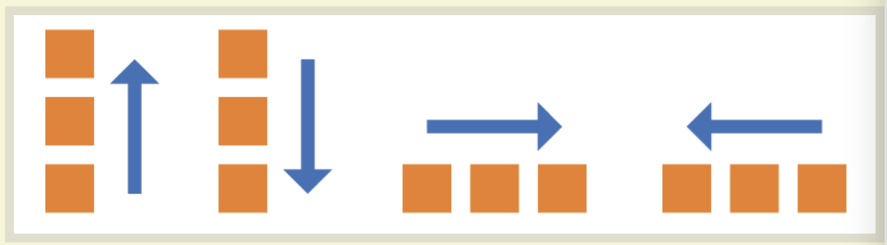
它可能有4个值：
* row（默认值）：主轴为水平方向，起点在左端；
* row-reverse：主轴为水平方向，起点在右端；
* column：主轴为垂直方向，起点在上沿；
* column-reverse：主轴为垂直方向，起点在下沿；

### 2.5.2 flex-wrap属性
默认情况下，项目都排在一条线（又称“轴线”）上，flex-wrap属性定义，如果一条轴线排不下，如何换行；
```css
.box{
  flex-wrap: nowrap | wrap | wrap-reverse;
}
```
可取三个值：
1. nowrap（默认）：不换行
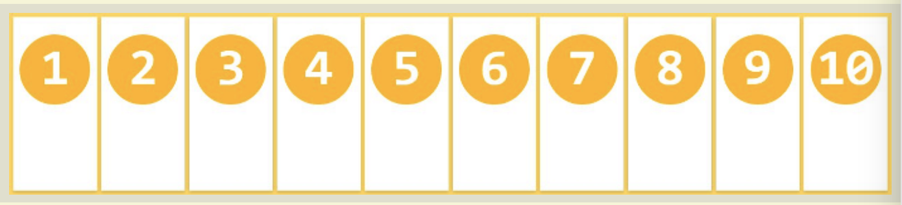
2. wrap：换行，第一行在上方
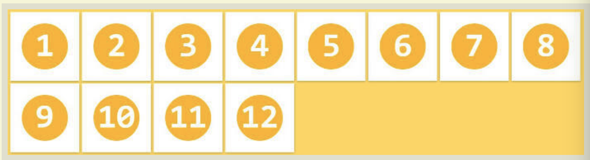
3. wrap-reverse：换行，第一行在下方
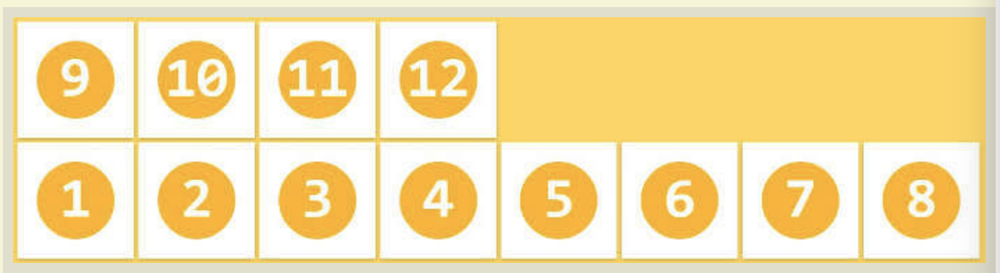;

### 2.5.3 flex-flow
flex-flow属性是flex-direction属性和flex-wrap属性的简写形式，默认为row nowrap。
```css
.box{
  flex-flow: <flex-direction> || <flex-wrap>;
}
```
 
 ### 2.5.4 justify-content属性
 justify-content属性定义了项目在主轴上的对齐方式。
 ```css
.box{
  justify-content: flex-start | flex-end | center | space-between | space-around;
}
 ```
 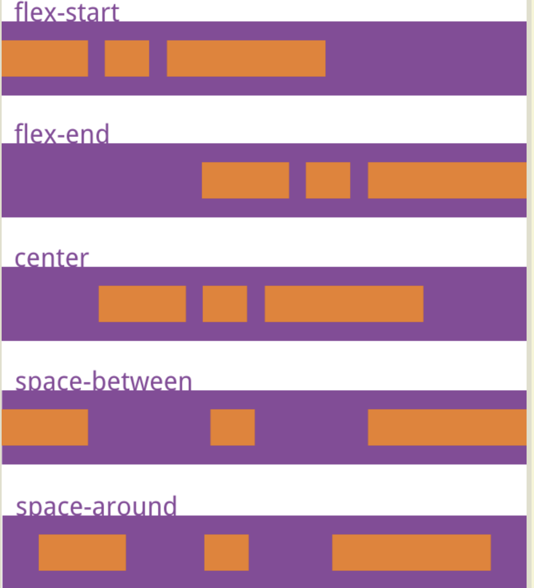;
 可取5个值，具体对齐方式与轴的方向有关，下面假设主轴为从左到右：
 * flex-start（默认值）：左对齐
 * flex-end:右对齐
 * center： 居中
 * space-between：两端对齐，项目之间的间隔都相等
 * space-around：每个项目两侧的间隔相等。所以项目之间的间隔比项目与边框的间隔大一倍。

 ### 2.5.5 align-items属性
 align-items属性定义项目在交叉轴上如何对齐：
 ```css
.box{
  align-items: flex-start | flex-end | center | baseline | stretch;
}
 ```
 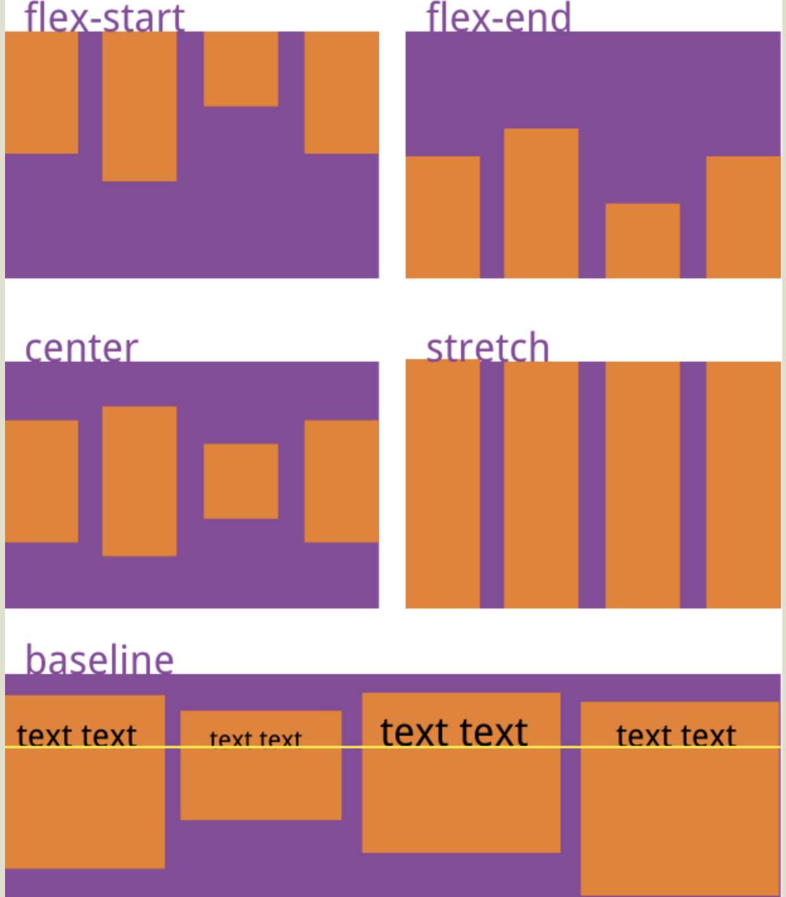;
可取5个值。具体的对齐方式与交叉轴的方向有关，下面假设交叉轴从上到下。
* flex-start：交叉轴的起点对齐。
* flex-end：交叉轴的终点对齐。
* center：交叉轴的中点对齐。
* baseline: 项目的第一行文字的基线对齐。
* stretch（默认值）：如果项目未设置高度或设为auto，将占满整个容器的高度。

### 2.5.6 align-content属性
align-content属性定义了多根轴线的对齐方式，如果项目只有一根轴线，该属性不起作用：
```css
.box{
  align-content: flex-start | flex-end | center | spance-between | spance-around | stretch;
}
```
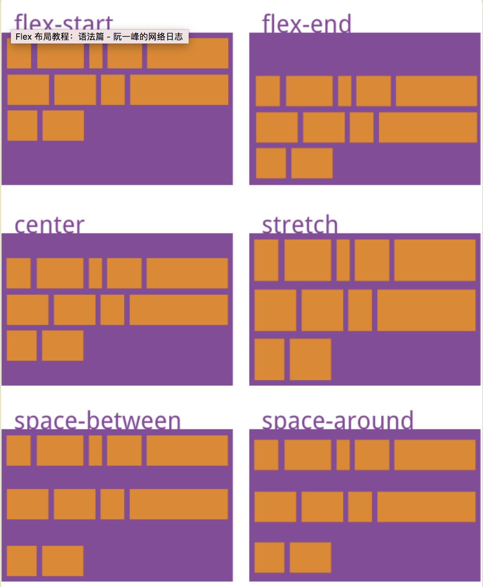

该属性可能取6个值：
* flex-start：与交叉轴的起点对齐。
* flex-end：与交叉轴的终点对齐。
* center：与交叉轴的中点对齐。
* space-between：与交叉轴两端对齐，轴线之间的间隔平均分布。
* space-around：每根轴线两侧的间隔都相等。所以，轴线之间的间隔比轴线与边框的间隔大一倍。
* stretch（默认值）：轴线占满整个交叉轴。


## 2.6 Css Sticky footers布局  
在网页设计中，Sticky footers设计是最古老和最常见的效果之一，大多数人都曾经经历过，它可概括如下：如果页面内容不够长的时候，页脚块粘贴在视窗底部，如果内容足够长时，页脚块会被内容向下推送。

### 把一个网站地址生成二维码  
草料二维码生成器：https://cli.im/ 
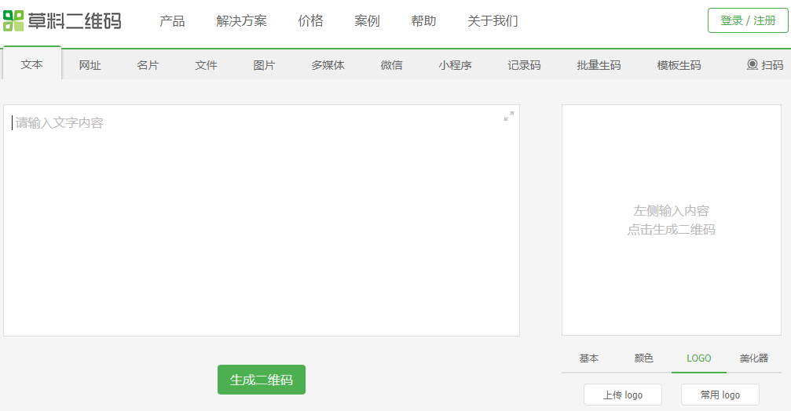

### 中间为字，两边为线  
```html
<div class="title">
  <div class="line"></div>
  <div class="text">优惠信息</div>
  <div class="line"></div>
</div>
```
```stylus
.title {
  width: 80%;
  display: flex;
  margin: 30px auto 24px auto;

  .line {
    flex: 1;
    position: relative;
    top: -6px;
    border-bottom: 1px solid rgba(255, 255, 255, 0.2);
  }

  .text {
    padding: 0 12px;
    font-size: 14px;
  }
}
```

## 2.7 Vue 过渡动画--transition标签
Vue在插入、更新或者移除DOM时，提供多种不同方式应用过度效果，包括以下方式：  
* 在css过渡和动画中自动应用class；
* 配合使用第三方css动画库；  
* 在过渡钩子函数中使用JavaScript直接操作DOM；  

### 单元素/组件的过渡
Vue提供了transition的封装组件，在下列情形中，可以给任何组件和元素添加进入/离开的过渡：
* 条件渲染（使用v-if）；
* 条件展示（使用v-show）；
* 动态组件
* 组件根节点
例子：
```html
<div id="demo">
  <button v-on:click="show = !show">Toggle</button>
  <transition name="fade">
    <p v-if="show">hello</p>
  </transition>
</div>
```
```javascript
new Vue({
  el: '#demo',
  data: {
    show: true
  }
})
```
```Css
.fade-enter-active, .fade-leave-active {
  transition: opactity .5s;
}
.fade-enter, .fade-leave-to {
  opactity: 0;
}
```
当插入或删除在transition组件中的元素是，Vue将会做以下处理：
1. 自动嗅探目标元素是否应用了CSS过渡或动画，这些钩子函数将在恰当时机添加/删除css类名；
2. 如果过渡组件提供了JavaScript钩子函数，这些钩子函数将在恰当的时机被调用；
3. 如果没有找到javascript钩子并且也没用检测到css过渡/动画，DOM操作（插入/删除）在下一帧中立即执行。（注意：此指浏览器逐帧动画机制，和vue的nextTick概念不同）。

### 过渡的类名
在进入/离开的过渡中，会有6个class切换：  
1. v-enter: 定义进入过渡的开始状态，在元素被插入之前生效，在元素被插入之后的下一帧移除；
2. v-enter-active：定义进入过渡生效时的状态。在整个进入过渡的阶段中应用，在元素被插入之前生效，在过渡/动画完成之后移除。这个类可以被用来定义进入过渡的过程时间，延迟和曲线函数；
3. v-enter-to: 2.1.8版及以上 定义进入过渡的结束状态。在元素被插入之后下一帧生效 (与此同时 v-enter 被移除)，在过渡/动画完成之后移除；
4. v-leave: 定义离开过渡的开始状态。在离开过渡被触发时立刻生效，下一帧被移除；
5. v-leave-active：定义离开过渡生效时的状态。在整个离开过渡的阶段中应用，在离开过渡被触发时立刻生效，在过渡/动画完成之后移除。这个类可以被用来定义离开过渡的过程时间，延迟和曲线函数；
6. v-leave-to: 2.1.8版及以上 定义离开过渡的结束状态。在离开过渡被触发之后下一帧生效 (与此同时 v-leave 被删除)，在过渡/动画完成之后移除。  
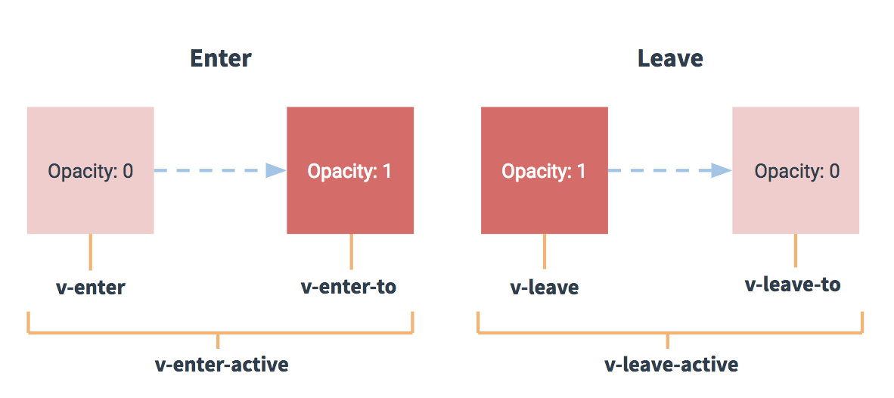

## 2.8 插件使用 

* babel-runtime---对ES6语法做转义；
* fastclick---移动端点击300ms延迟；
```JavaScript
import fastclick from 'fastclick';

fastclick.attach(document.body);
```
* babel-polyfill---（补丁）对ES6的API（如Promise）做转义；

* jsonp ---跨域请求时使用  
```JavaScript
import originJSONP from 'jsonp';

export default function jsonp(url, data, option){
  url += (url.indeOf('?')<0 ? "?" : "&") + param(data);
  return new Promise((resolve, reject)=>{
    originJSONP(url,option,(err, data)=>{
      if(!err){
        resolve(data);
      }else{
        reject(err);
      }
    })
  })
}
//把data拼到url上
function param(data){
  let url = '';
  for(var k in data){
    let value = data[k] !== undefined ? data[k] : '';
    url += `&${k} = ${encodeURIComponent(value)}`;
  }
  return url ? url.substring(1) : '';
}
```
* butter-scroll---移动端做轮播时用到
* vue-lazyload---图片懒加载
```JavaScript
//main.js
import VueLazyLoad from 'vue-lazyload';
Vue.use(VueLazyLoad, {
  loading: require('common/image/default.png');
});

//组件中使用时
//

```
* fastclick与butter-scroll冲突时，给要点击的元素添加：`class='needsclick'`;

## 2.9 在Vue获取元素引用
```JavaScript
<div class='slider' ref='slider'>
  <div class="slider-group" ref='dliderGroup'>
    <slot></slot>
  </div>
</div>

methods:{
  _setSliderWidth(){
    this.children = this.$refs.sliderGroup.children;
  }
}
```

## 2.10 在Window大小发生改变时，轮播图如何撑满  
在组件mounted之后给window绑定监听事件：
```JavaScript
mounted(){
  window.addEventListener('resize', ()=>{
    if(!this.slider){
      return
    }
    //....doSomething
  })
}
```

## 2.11 何时使用Keep-Alive：  
在“推荐”页面时，轮播图正常运行，当进行tab也得切换时，组件会重新渲染，“推荐”页会重新发请求，此时可用Keep-Alive解决这个问题，在App.vue文件中用keep-alive标签把router-view包裹：
```JavaScript
<keep-alive>
  <router-view></router-view>  
</keep-alive>
```


# 3. Vue学习总结
在这次Vue的学习中，主要了解了Vue框架的基本用法，路由配置，在项目练习中，学习到了Vue脚手架vue-cli的用法。由于这次的项目没有使用UI框架，又是一个移动端项目，在做的过程中，老师除了教授Vue的基本知识，一些主要收获是在Vue中如何引用dom元素、何时使用keep-alive、组件的生命周期和组件件间的通讯问题。也讲到了一些用于做动画效果的插件，如better-scroll，还有一些移动端的布局问题，如移动端1px边框问题、flex布局、经典Css Sticky footers布局，以及在Window大小发生改变时，轮播图如何撑满，还有vue本身的用于做过渡动画的transition标签。  
这次项目练习主要是模仿饿了么外卖做了一下功能和效果，主要是对vue的基础内容做也个简单的实战练习，完成的的主要功能点有：在本地配置node跑一些接口，通过请求的方式拿到数据，而不是直接使用假数据；商品列表、商品详情；商家详情；商品加入和移除购物车；以及商品加入购物车小球飞入动画和better-scroll的使用。